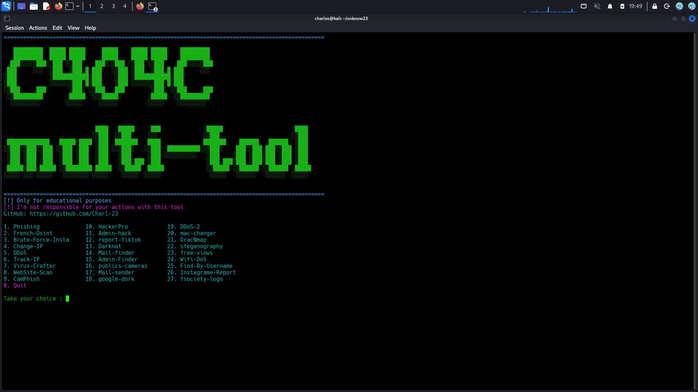

<div align="center">

# ⚔️ Multi-Tool


<br/>

**Suite d'outils pour le pentesting, OSINT, réseau, phishing et plus encore.**  
**Toolkit for pentesting, OSINT, networking, phishing and more.**

</div>

---

## 📸 Aperçu / Preview

<div align="center">
  
</div>

---

## 🇫🇷 Présentation

**Multi-Tool** est une suite d'outils orientée sécurité offensive, conçue pour les passionnés de cybersécurité et les professionnels du pentest.  
Ce projet regroupe plusieurs scripts et utilitaires pour faciliter les audits de sécurité, la collecte d'informations (OSINT), les tests réseau et les simulations d'ingénierie sociale.

> ⚠️ **Usage réservé à des fins éducatives et légales uniquement.**

---

## 🇬🇧 About

**Multi-Tool** is an offensive security toolkit designed for cybersecurity enthusiasts and pentest professionals.  
This project gathers multiple scripts and utilities to ease security audits, information gathering (OSINT), network testing and social engineering simulations.

> ⚠️ **Use only for educational and legal purposes.**

---

## 🛠️ Fonctionnalités / Features

| # | Catégorie | Description FR | Description EN |
|---|---|---|---|
| 🔍 | **OSINT** | Recherche d'infos en ligne, analyse de données publiques, recherches via bases de données | Internet info gathering, public data analysis, database lookups |
| 🌐 | **Réseau / Network** | Scans de ports, changement d'adresse MAC, tests de vulnérabilité | Port scanning, MAC address changer, vulnerability tests |
| 🎣 | **Phishing & Social** | Outils d'ingénierie sociale, clonage de pages, simulations | Social engineering tools, page cloning, simulations |
| 💥 | **DDoS & Stress Tests** | Simulations d'attaques pour tests de résistance internes | Attack simulations for internal stress testing |
| 🧰 | **Divers / Misc** | Stéganographie, changement d'IP, utilitaires variés | Steganography, IP changer, various utilities |

> ⚠️ Certains outils nécessitent un **environnement virtuel Python (venv)**.  
> ⚠️ Some tools require a **Python virtual environment (venv)**.
> ```bash
> python3 -m venv venv
> source venv/bin/activate
> ```

---

## 🚀 Installation

```bash
git clone https://github.com/Charl-23/Multi-Tool.git
cd Multi-Tool
bash install.sh
```

---

## ⚠️ Avertissement légal / Legal Disclaimer

> 🇫🇷 Ce projet est destiné **uniquement à des fins éducatives** et à des tests sur des systèmes vous appartenant ou pour lesquels vous avez une **autorisation explicite écrite**.  
> L'utilisation de ces outils sur des systèmes tiers sans autorisation est **illégale** et peut entraîner des poursuites judiciaires. L'auteur décline toute responsabilité pour toute utilisation abusive.

> 🇬🇧 This project is intended **for educational purposes only** and for testing on systems you own or have **explicit written permission** to test.  
> Using these tools on third-party systems without authorization is **illegal**. The author takes no responsibility for any misuse.

---

## 👤 Auteur / Author

**C404C**  
🔗 GitHub : [@Charl-23](https://github.com/Charl-23)

---

<div align="center">
  <sub>Made with ❤️ on Kali Linux</sub>
</div>
